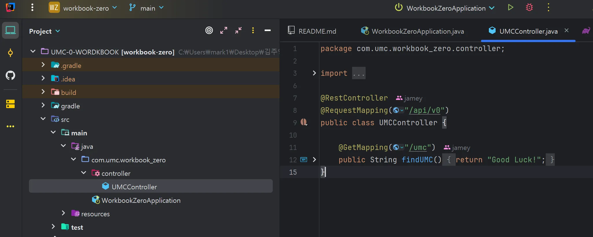
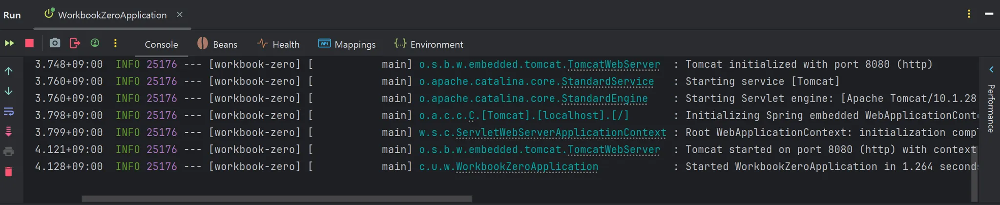
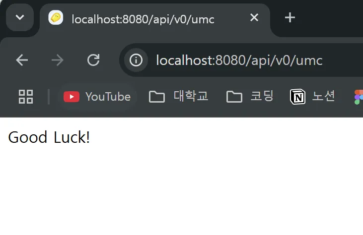

## 🎯핵심 키워드

---

<aside>
💡 주요 내용들에 대해 조사해보고, 자신만의 생각을 통해 정리해보세요!
레퍼런스를 참고하여 정의, 속성, 장단점 등을 적어주셔도 됩니다.
조사는 공식 홈페이지 **Best**, 블로그(최신 날짜) **Not Bad**

</aside>

- IP
    
    IP란 Network Layer에서 작용하며 인터넷상에서 유일하게 상대를 식별할 수 있는 수단이다.
    
    쉽게 말하면 아파트의 ~동까지 적혀있는 주소이다.
    
- PORT
    
    PORT란 같은 IP내에서 프로세스를 구분하는 데 사용되는 번호를 의미한다.
    
    쉽게 말하면 아파트의 호수 이다.
    
- CIDR
    
    CIDR이란, 사용되는 호스트의 수가 늘어남에 따라 할당 가능한 IP주소의 수가 고갈되는 것과 라우팅 테이블의 크기가 커지는 문제를 해결하기 위해 도입한 표준 IP 주소 할당 방식이다. CIDR은 기존의 클래스 기반 IP주소 할당 방식보다 인터넷상의 데이터 라우팅 효율성을 향상시키는 IP 주소 할당 방법이다. 
    
    참고 문서: https://aws.amazon.com/ko/what-is/cidr/
    
- TCP와 UDP 차이
    
    ### TCP
    
    - TCP는 3 way-handshake를 통해 데이터를 보내기에 앞서 상대방이 있는지 확인한다. 이를 통해 서로 받을 수 있는 상태라는 것이 보증되게 된다.
    
    - 장점: 데이터가 안전하게 전달된다.
    - 단점: 느리다
    
    ### UDP
    
    - UDP는 TCP와 달리 데이터 전달 보증, 순서 보장 없이 기존의 IP에 PORT와 체크 썸만 추가한 프로토콜이다. TCP에 비해 신뢰성이 떨어지지만 빠르다는 장점이 있다.
    
    - 장점: 데이터가 빠르게 전달된다.
    - 단점: 데이터가 유실될 수 있다.
- Web Server와 WAS의 차이
    
    서버의 종류를 크게 두 가지로 나누면, 정적 리소스를 처리하는 Web Server와 동적 리소스를 처리 가능한 WAS가 존재한다.
    
    ### WAS
    
    - WAS란 동적 리소스(DB 조회나 다양한 로직을 처리하는 것을 의미)를 처리해 주는 서버를 말한다. 대표적으로 Spring Boot의 내장 서버인 Tomcat이 있다.
    
    ### Web Server
    
    - Web Server란 정적 리소스(예. HTML, CSS, 이미지 등)를 처리해 주는 서버를 말한다. 대표적으로 Apache, Nginx등이 있다.

## ⚠️ 스터디 진행 방법

---

1. 스터디를 진행하기 전, 워크북 내용들을 모두 채우고 스터디에서는 서로 모르는 내용들을 공유해주세요.
2. 미션은 워크북 내용들을 모두 완료하고 나서 스터디 전/후로 진행해보세요.
3. 다음주 스터디를 진행하기 전, 지난주 미션을 서로 공유해서 상호 피드백을 진행하시면 됩니다.

## ✅ 실습 체크리스트

---

## ☑️ 실습 인증

---

## 🔥 미션

---

1. 너디너리 홈페이지 접속하는 과정 적어보기 (소켓프로그래밍과 같은 개념 없이 TCP, IP, PORT 등의 개념 등 오늘 배운 내용으로 간단하게 적어주세요)
2. 깃허브 clone 받아서 실행하고 나온 페이지 스크린 샷 찍기

## 💪 미션 기록

---

<aside>
🍀 미션 기록의 경우, 아래 미션 기록 토글 속에 작성하시거나, 페이지를 새로 생성하여 해당 페이지에 기록하여도 좋습니다!

하지만, 결과물만 올리는 것이 아닌, **중간 과정 모두 기록하셔야 한다는 점!** 잊지 말아주세요.

</aside>

- **미션 기록**
    
    ### 1. 너디너리 홈페이지 접속과정
    
    1. 패킷에 IP주소를 담고 Access Network를 통해 Network Core로 보낸다.
    2. router는 패킷의 IP를 확인 후 더 알맞은 router로 보냄
    3. Network Edge에 도착하면 Network Layer에서 패킷 확인 후 자신의 IP와 일치하면 Transport Layer로 올린다. 만약 아니라면 다른 곳으로 보내게 된다.
    4. 마지막으로 443포트의 너디너리 홈페이지에 접속하게 된다.
    
    ### 2. 페이지 스크린 샷 찍기
    
    1. **클론 완료된 모습**
    

    1. **실행 완료된 모습**
     
    
    1. **페이지 스크린 샷**
    