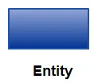

# 🎯 핵심 키워드

---

<aside>
💡 주요 내용들에 대해 조사해보고, 자신만의 생각을 통해 정리해보세요!
레퍼런스를 참고하여 정의, 속성, 장단점 등을 적어주셔도 됩니다.
조사는 공식 홈페이지 **Best**, 블로그(최신 날짜) **Not Bad**

</aside>

- 외래키
    - 테이블간의 관계를 나타낼때 사용하며, 다른 테이블의 기본키를 참조해 외래키로 사용한다.
- 기본키
    - 주 키, 프라이머리 키, PK 등으로 불리우며, 후보들 중 메인으로 선정되는 키이다.
    - 유일성과 최소성을 가지며, 해당 레코드를 식별할때 기준이 되는 반드시 필요한 키이다.
- ER 다이어그램
    
    ER다이어그램이란, 시스템의 엔티티들이 무엇이 있는지 어떤 관계가 있는지를 나타내는 다이어그램이다. 주로 관계형 DB에서 많이 사용되며, 테이블들과 관계들을 시각화할 수 있기 때문에 설계 문제점을 쉽게 파악할 수 있다는 장점이 있다.
    
    **기본 요소**
    
    **Entity**
    
    - 어떤 시스템인지에 따라 사람, 장소, 사건, 오브젝트가 될 수 있다.
    - ER다이어그램에서 사각형으로 그린다.
        
        
        
    
    **Attribute**
    
    - 특성, 엔티티의 성격, 관계, 또다른 속성이다.
    - ER다이어그램에서 타원형으로 그린다.
        
        
    
    **Relationship**
    
    - Entity 간의 상호작용을 표현한다.
    - ER다이어그램에서 마름모로 그린다.
        
        
        
    
     
    
- 복합 키
    - 두 개 이상의 컬럼을 묶어서 하나의 기본키로 지정하는 것이다.
- 연관관계
    
    연관관계란 두 개 이상의 테이블 간에 존재하는 관계를 의미한다.
    
    **연관관계의 종류**
    
    - 일대일 ( 1 to 1 )
    - 일대다 ( 1 to N)
    - 다대일 ( N to 1)
    - 다대다 (N to M)
- 정규화
    
    **정규화(Normalization)**
    
    - 정규화는 함수적 종속성의 특징에 따라 테이블을 분해해 나가는 과정이다.
    
    **정규화를 시키는 이유!**
    
    - 비정규 릴레이션에서의 삽입, 삭제, 갱신이상 현상을 줄이고자 효율적인 데이터베이스 스키마를 구축하기 위해 정규화 과정이 필요하다.
    
    **정규화의 목적**
    
    - 데이터 구조의 안정성을 최대화시킨다.
    - 중복을 배제하여 삽입, 삭제, 갱신 이상의 발생을 방지한다.
    - 어떠한 릴레이션이라도 데이터베이스 내에서 표현 가능하게 한다.
    - 효율적으로 검색이 가능하도록 한다.
    
    **정규화 과정**
    
    
    
    1. **제1정규형 (1NF)**
        1. 릴레이션에 속한 모든 도메인이 원자(더이상 쪼갤 수 없는)값이어야 한다.
            1. 아래의 사진과 같이 하나의 값만 들어가야 한다.
                
                
                
    2. **제2정규형 (2NF)**
        1. 키가 아닌 모든 속성들이 기본키에 완전 함수 종속되어야 한다.
            1. 아래의 사진을 보면 상품ID만으로도 단위와 단가가 1대1 매칭이 된다. 
                
                
                
                그래서 기본키의 주문번호가 없어도 식별이 되기 때문에, 아래의 상품과 주문상세로 테이블을 분해시켜 주어 제2정규형을 만족시켜 주어야 한다.
                
                
                
    3. **제 3정규형(3NF)**
        1. 키가 아닌 모든 속성들이 기본키에 이행적으로 함수종속되지 않은 릴레이션
            1. 아래의 사진을 보면 주문번호→ 회원ID → 회원명 | 회원등급으로 이행적 함수 종속이 발생한다. 
                
                
                
                그렇기에 아래와 같이 회원 테이블을 따로 분해하여 이행적 함수 종속을 없애주어야 한다.
                
                
    
    1. BCNF (Boyce-Codd NF)
        1. 릴레이션의 모든 결정자가 후보키인 릴레이션
            1. 아래의 사진을 보면 (학번, 과목명)기본키 → 교수지만, 교수 → 과목명 형식인 것을 볼 수 있다. 여기서 교수는 과목명에 대해 1대1 대응이 되는 것을 볼 수 있다.
                
                
                
                이에 따라 교수는 후보키가 될 수 없기에, 테이블을 아래와 같이 분해해주어야 한다.
                
                
                
- 반 정규화
    
    **반정규화란?**
    
    - 반정규화는 정규화된 엔티티, 속성, 관계에 대해 시스템의 성능향상, 개발, 운영의 단순화를 위해 중복, 통합, 분리 등을 수행하는 데이터 모델링의 기법이다.
    
    **반정규화를 하는 이유?**
    
    - 데이터를 조회할 때 조인으로 인한 성능저하가 예상될 때 수행한다.
    
    **반정규화 기법**
    
    1. 테이블 반정규화
        1. 테이블 병합
            1. 1:1 관계 테이블 병합
            2. 1:M 관계 테이블 병합
            3. 슈퍼/서브타입 테이블 병합
        2. 테이블 분할
            1. 수직분할
            2. 수평분할
        3. 테이블 추가
            1. 중복 테이블 추가
            2. 통계 테이블 추가
            3. 이력 테이블 추가
            4. 부분 테이블 추가
    2. 속성 반정규화
        1. 중복 칼럼 추가
        2. 파생 칼럼 추가
        3. 이력 테이블 칼럼 추가
        4. PK에 의한 칼럼 추가
        5. 응용시스템 오작동을 위한 칼럼 추가
    3. 관계 반정규화
        1. 중복 관계 추가

## 📢 학습 후기

---

- 이번 주차 워크북을 해결해보면서 어땠는지 회고해봅시다.
- 핵심 키워드에 대해 완벽하게 이해했는지? 혹시 이해가 안 되는 부분은 뭐였는지?

<aside>
💡

</aside>

## ⚠️ 스터디 진행 방법

---

1. 스터디를 진행하기 전, 워크북 내용들을 모두 채우고 스터디에서는 서로 모르는 내용들을 공유해주세요.
2. 미션은 워크북 내용들을 모두 완료하고 나서 스터디 전/후로 진행해보세요.
3. 다음주 스터디를 진행하기 전, 지난주 미션을 서로 공유해서 상호 피드백을 진행하시면 됩니다.

## ✅ 실습 체크리스트

---

- [x]  로컬 DB 설정
- [x]  DB 접속

## ☑️ 실습 인증

---

**<WorkBench>**

**<DataGrip>**

## 🔥 미션

---

- **미션 자료**
    
    <aside>
    🚨 ❗**해당 자료는 챌린저분들의 미션을 위해 Plan 파트에서 제공해준 자료로,
    미션 외의 용도로 사용하는 것 및 유출을 절대 금합니다.**❗
    
    **❗아래 IA&WF 사진 및 for_UMC.fig 파일 및 파일 속 내용의 저작권은 모두 5th UMC Plan 파트장 아크(박승민)에게 있음을 밝힙니다.❗**
    
    </aside>
    
    - IA&WF 사진 파일
        
        아래 사진 외에도 첨부드린 사진에 해당하는 피그마 파일이 존재하니
        사진을 통해 보기 어려우시다면 피그마 파일을 이용해주세요!
        
        
        IA
        
        
        WF
        
    
    [for_UMC.fig](attachment:a1f51a0a-f670-48de-bf91-c9671149b78b:for_UMC.fig)
    
1. 주어진 IA(기획 플로우)와 와이어 프레임(디자인 프로토타입)을 보고 직접 데이터베이스를 설계해오기, 위에서 언급한 경우를 다 적용해서 할 것
2. 이름 글자 수 등 세부적인 부분은 원하는 대로 해도 됨!
3. 각 지역 별로 가게들이 있으며 가게를 방문하는 미션을 해결하며 포인트를 모으는 서비스
    1. 모든 지역마다 10개의 미션 클리어시 1000 point 부여로 고정

**최소한 로그인/회원가입, 미션, 홈 화면에 필요한 데이터는 설계를 해야함, 되어있지 않다면 원 아웃**

***미션 난이도 완화를 위해 지도 검색 기능 전부 pass, 저 부분은 설계 하지 마세요***

***내 포인트 관리, 알 부분도 설계하지 마세요***

***사장님이 자신의 점포 관리하는 부분도 설계 대상에서 제외입니다.***

물론 원하시면 하셔도 됩니다. 😉

**< 시니어 미션 >**

[시니어 미션](https://www.notion.so/1b7b57f4596b81989532e65f80bc1021?pvs=21)

## 💪 미션 기록

---

<aside>
🍀 미션 기록의 경우, 아래 미션 기록 토글 속에 작성하시거나, 페이지를 새로 생성하여 해당 페이지에 기록하여도 좋습니다!

하지만, 결과물만 올리는 것이 아닌, **중간 과정 모두 기록하셔야 한다는 점!** 잊지 말아주세요.

</aside>

- **미션 기록**
    
    
    1. 기본적으로 들어갈 속성을 추가해 주었다.
       
    
    +) 영업시간, 휴무시간 추가
    
    
    2. 타입을 명시해준다.
        
        
    
    +)음식점 주소 추가 
    
    
    3. 생성 및 수정시간을 추가해준다.
        
        
        
    
    4. 사용자에 status와 inactive_date를 추가해주어 회원 탈퇴 후 회원 정보 복구 기간을 만들 수 있게 해준다.
        
        
    5. 테이블 매핑
        
        
    
    6. 알람로직 추가
        
        
    
    +) 포인트 내역, 미션 테이블 추가
    
    
    
    추가) 선호음식 - 음식점 N:M매핑, 노출 여부 컬럼 추가
    
    