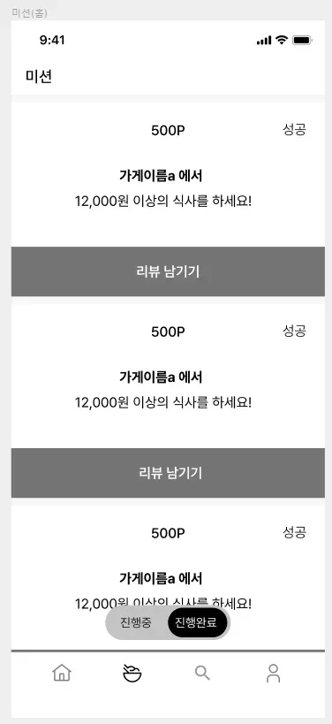

## 🔥 미션

---

- 1주차 때 설계한 데이터베이스를 토대로 아래의 화면에 대한 쿼리를 작성

    1. 내가 진행중, 진행 완료한 미션 모아서 보는 쿼리(페이징 포함)

    2. 리뷰 작성하는 쿼리,
        * 사진의 경우는 일단 배제

    3. 홈 화면 쿼리
        * (현재 선택 된 지역에서 도전이 가능한 미션 목록, 페이징 포함)

    4. 마이 페이지 화면 쿼리

## 💪 미션 기록 (여기에 해도 되고 위의 미션에서 각 페이지 밑에 간단하게 블록 만들어서 하셔도 됩니다!)

---

<aside>
🍀 미션 기록의 경우, 아래 미션 기록 토글 속에 작성하시거나, 페이지를 새로 생성하여 해당 페이지에 기록하여도 좋습니다!

하지만, 결과물만 올리는 것이 아닌, **중간 과정 모두 기록하셔야 한다는 점!** 잊지 말아주세요.

</aside>

- **미션 기록**
    - 미션 모아보기

        
        
        내가 진행중, 진행 완료한 미션 모아서 보는 쿼리(페이징 포함)
        
        **필요한 정보**
        
        1. 가게 이름
        2. 가게 아이디
        3. 미션 성공 여부
        4. 미션 내용
        5. 미션 리워드
        
        처음 짠 쿼리문
        
        ```sql
        SELECT b.status, c.mission_spec, d.name
        FROM member AS a
        LEFT JOIN member_mission AS b	ON a.id = b.member_id
        LEFT JOIN mission AS c ON b.mission_id = c.id
        LEFT JOIN store AS d	ON c.store_id = d.id
        WHERE b.created_at < 
        	(SELECT created_at	FROM b	WHERE id = {마지막으로 본 미션 id})
        ORDER BY b.created_at desc limit {한 페이지에 보여줄 개수} 
        ```
        
        ### 문제점
        
        1. 서브쿼리에서 별칭을 사용하면 안됨 (ex. b)
        2. `WHERE b.created_at < (서브쿼리)` 에서 id = {마지막으로 본 미션 id}인 행이 없으면 오류가 날 수 있음
        3. 특정 사용자 식별 불가능함
        4. 가게 id가 없으면 리뷰 남기기 불가
        5. 만료된 미션은 보이면 안됨
        6. 미션 리워드가 없음
        
        다시 짠 쿼리문
        
        ```sql
        SELECT b.status, c.mission_spec, c.reward, d.id, d.name
        FROM member AS a
        LEFT JOIN member_mission AS b	ON a.id = b.member_id
        LEFT JOIN mission AS c ON b.mission_id = c.id
        LEFT JOIN store AS d	ON c.store_id = d.id
        WHERE a.id = {특정 사용자 id}
        	AND c.deadline > {오늘 날짜}
        	AND	(b.created_at < 
        		(SELECT created_at	FROM member_mission	WHERE id = {마지막으로 본 미션 id}) OR {마지막으로 본 미션 id} IS NULL)
        ORDER BY member_mission.created_at DESC LIMIT {한 페이지에 보여줄 개수} 
        ```
        
    - 리뷰 작성 쿼리
        
        
        ![리뷰 작성하는 쿼리, * 사진의 경우는 일단 배제]
        
        
        
        리뷰 작성하는 쿼리,
        * 사진의 경우는 일단 배제
        
        **필요한 정보**
        
        1. 가게 이름
        2. 리뷰 내용
        3. 리뷰 평점
        4. 닉네임
        5. 작성일
        
        ```sql
        SELECT a.name, b.body, b.score, b.created_at, c.name
        FROM store AS a
        LEFT JOIN review AS b ON a.id = b.store_id
        LEFT JOIN member AS c ON b.member_id = c.id
        WHERE a.id = {특정 점포의 id} 
        ```
        
        ### 문제점
        
        - 리뷰가 없는 음식점도 조회됨
        
        다시 짠 쿼리
        
        ```sql
        SELECT a.name, b.body, b.score, b.created_at, c.name
        FROM store AS a
        INNER JOIN review AS b ON a.id = b.store_id
        INNER JOIN member AS c ON b.member_id = c.id
        WHERE a.id = {특정 점포의 id} 
        ```
        
    - 홈 화면 쿼리
        
        
        ![홈 화면 쿼리
        (현재 선택 된 지역에서 도전이 가능한 미션 목록, 페이징 포함)]
        
        
        홈 화면 쿼리
        (현재 선택 된 지역에서 도전이 가능한 미션 목록, 페이징 포함)
        
        **필요한 정보**
        
        1. 지역 이름
        2. 해당 지역의 미션 완료 개수
        3. 미션 마감일
        4. 미션 내용
        5. 미션 포인트
        6. 가게 이름
        7. 가게 아이디
        
        처음 짠 쿼리
        
        ```sql
        SELECT a.status, a.created_at, b.reward, b.deadline, b.mission_spec, c.name, d.name
        FROM member_mission AS a
        LEFT JOIN mission AS b ON a.mission_id = b.id
        LEFT JOIN store AS c ON b.store_id = c.id
        INNER JOIN region AS d ON c.region_id = d.id
        WHERE a.member_id = {특정 사용자의 id}
        	AND a.status = "진행중"
        	AND d.id = {특정 지역의 id}
        	AND (a.created_at < 
        		(SELECT created_at FROM member_mission WHERE id = {마지막으로 본 미션 id}) 
        			OR {마지막으로 본 미션 id} IS NULL)
        ORDER BY member.mession.created_at DESC 
        LIMIT {한 페이지에 보여줄 개수}
        ```
        
        ### 문제점
        
        - 마지막 줄 member.mession 오타
        - SQL문에선 작은 따옴표를 사용함
        - 미션 생성일, 진행여부 사용 x
        - 가게 id가 있어야지 ‘미션 도전!’을 눌렀을 때 해당 가게 페이지로 이동 가능
        - 지역별로 성공한 미션 개수 필요
        
        수정한 쿼리
        
        ```sql
        SELECT b.reward, b.deadline, b.mission_spec, c.id, c.name, d.name, COALESCE(count.mission_count, 0)
        FROM member_mission AS a
        LEFT JOIN mission AS b ON a.mission_id = b.id
        LEFT JOIN store AS c ON b.store_id = c.id
        LEFT JOIN region AS d ON c.region_id = d.id
        LEFT JOIN ( 
            SELECT mission_id, COUNT(*) AS mission_count
            FROM member_mission
            WHERE status = '완료'
            GROUP BY mission_id
        ) AS count ON b.id = count.mission_id
        WHERE a.member_id = {특정 사용자의 id}
        	AND a.status = '진행중'
        	AND d.id = {특정 지역의 id}
        	AND (a.created_at < 
        		(SELECT created_at FROM member_mission WHERE id = {마지막으로 본 미션 id}) 
        			OR {마지막으로 본 미션 id} IS NULL)
        ORDER BY b.created_at DESC 
        LIMIT {한 페이지에 보여줄 개수}
        ```
        
        COALESCE → missioin_count가 null일 경우 0을 반환 시킴
        
    - 마이 페이지 화면 쿼리
        
        
        ![마이 페이지 화면 쿼리]

        
        
        마이 페이지 화면 쿼리
        
        **필요한 정보**
        
        1. 사용자 id
        2. 사용자 이름
        3. 이메일
        4. 휴대폰 번호
        5. 포인트
        
        처음 짠 쿼리
        
        ```sql
        SELECT m.id, m.name, m.email, m.phone, m.point
        FROM member AS m
        WHERE m.id = {특정 사용자의 id}
        ```
        
    
    `@ xxxx` 을 사용하면 외부에서 데이터를 받을 수 있음!